<div align="center">

# 杀戮猪塔

**一个用 JavaFX 从零实现的《杀戮尖塔》式卡牌 Roguelike —— 全员猪化版**

JDK 17 · JavaFX 21.0.6 · Maven · 52 个 Java 类 · 无游戏引擎，界面与演出全部手写

</div>

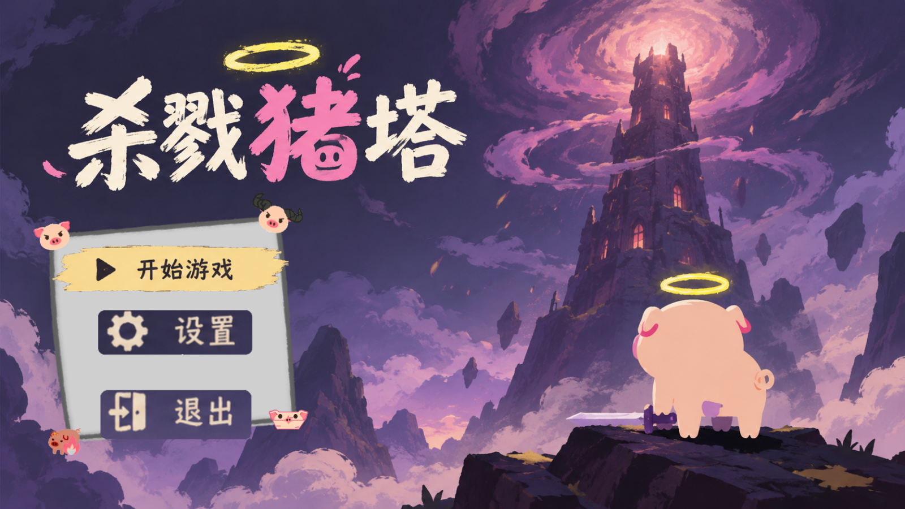

---

## 实机演示

以下截图均取自实际运行画面（1600×900），按一局游戏的推进顺序排列。

<table>
<tr>
<td width="50%"><br><b>主菜单</b> · 开始游戏 / 设置 / 退出</td>
<td width="50%">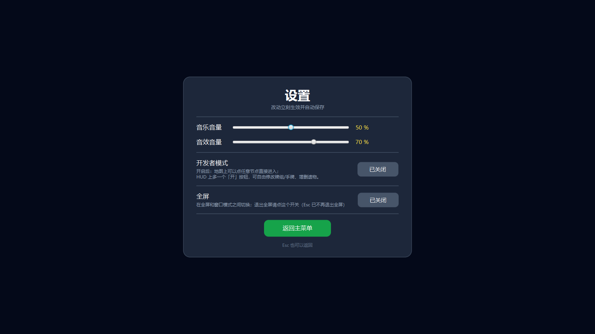<br><b>设置</b> · 音乐与音效音量、开发者模式、全屏，改动立即生效并自动保存</td>
</tr>
<tr>
<td width="50%">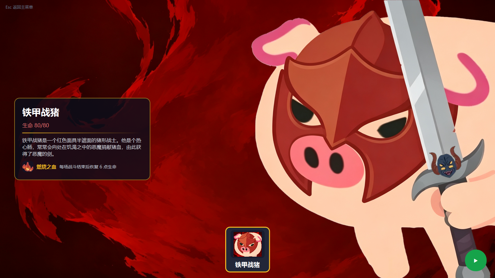<br><b>角色选择</b> · 铁甲战猪，80 生命，起始遗物「燃烧之血」</td>
<td width="50%"><br><b>起点房间</b> · 「猪神」开场赠予，选一件遗物后出发</td>
</tr>
<tr>
<td width="50%">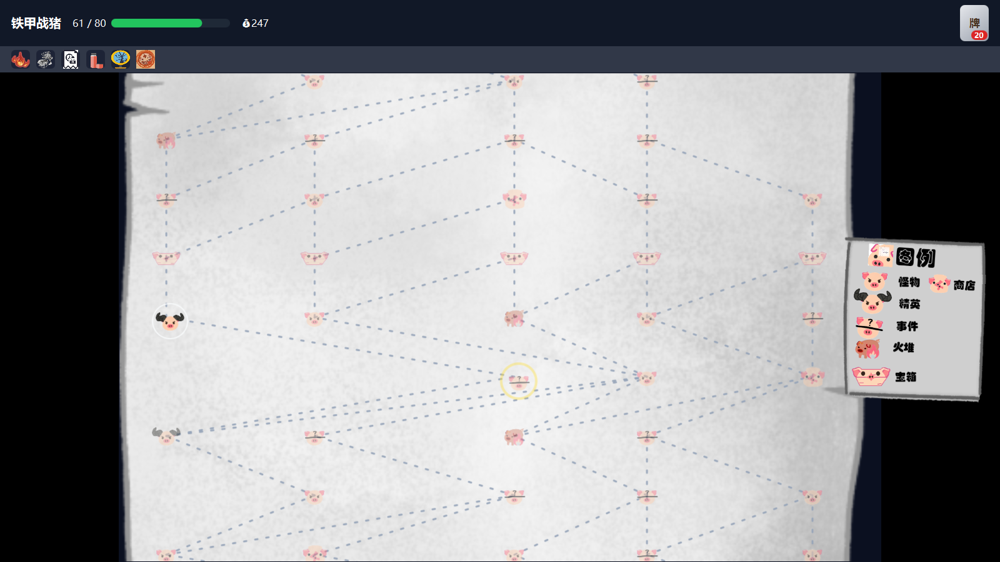<br><b>地图</b> · 17 层分叉路线，右侧图例；金圈为当前位置，白圈为可走节点</td>
<td width="50%">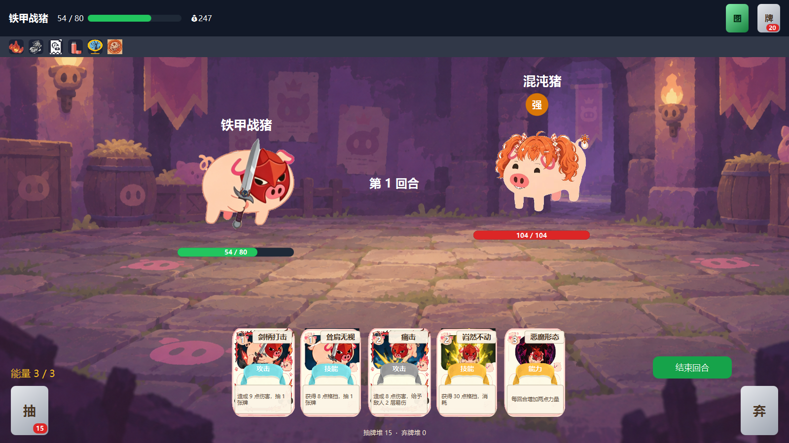<br><b>战斗</b> · 能量、手牌、抽/弃牌堆、双方血条与敌人标记</td>
</tr>
<tr>
<td width="50%">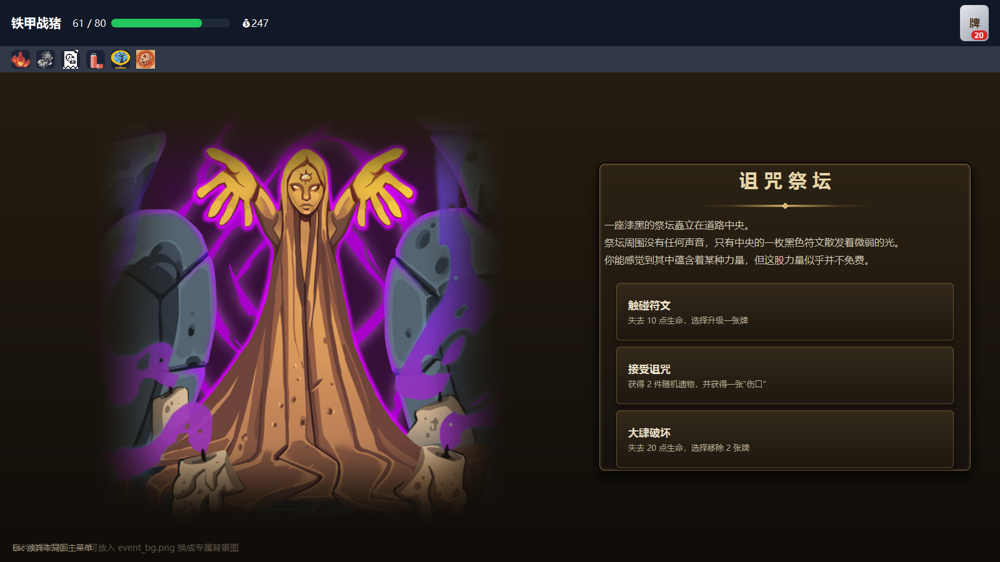<br><b>事件</b> · 左侧插图 + 右侧石板面板，每个选项写明代价与收益</td>
<td width="50%">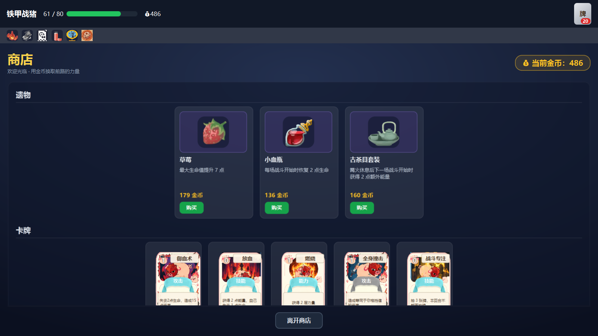<br><b>商店</b> · 遗物与卡牌两栏，用金币购买，随时可离开</td>
</tr>
<tr>
<td width="50%">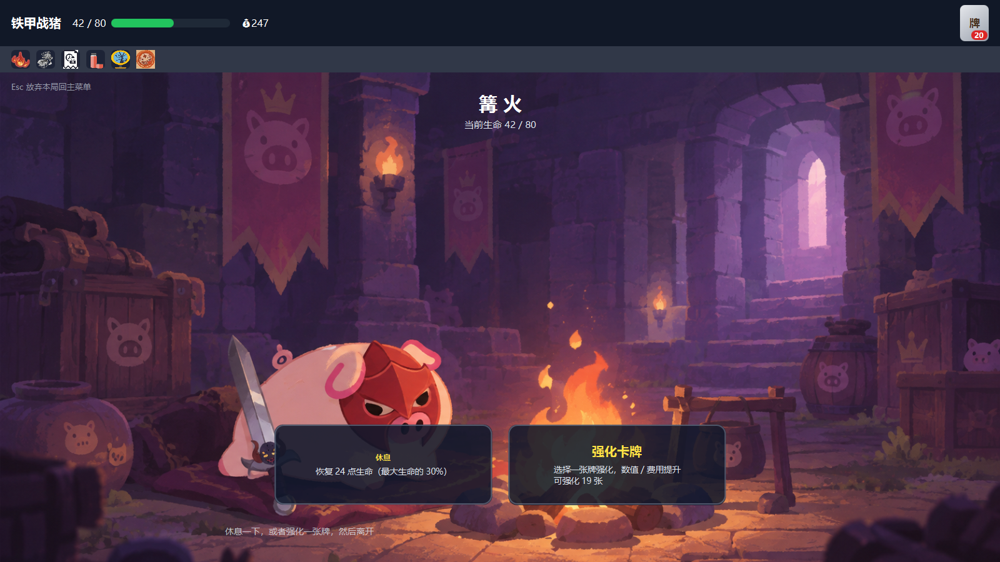<br><b>篝火</b> · 二选一：休息回血（最大生命的 30%）或强化一张牌</td>
<td width="50%">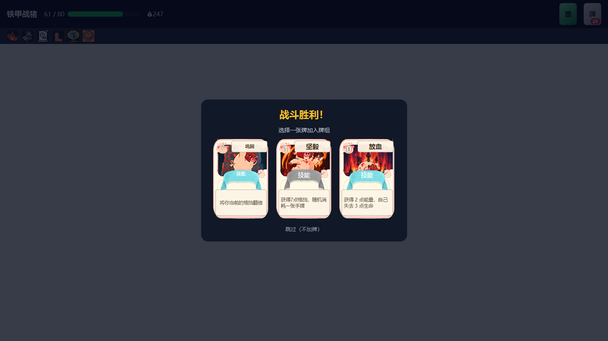<br><b>卡牌奖励</b> · 战斗胜利后三选一，也可以跳过不加牌</td>
</tr>
<tr>
<td width="50%">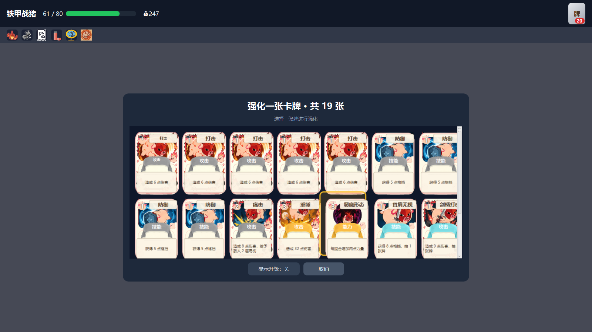<br><b>选牌强化</b> · 从牌组中挑一张升级，重复卡会显示张数</td>
<td width="50%">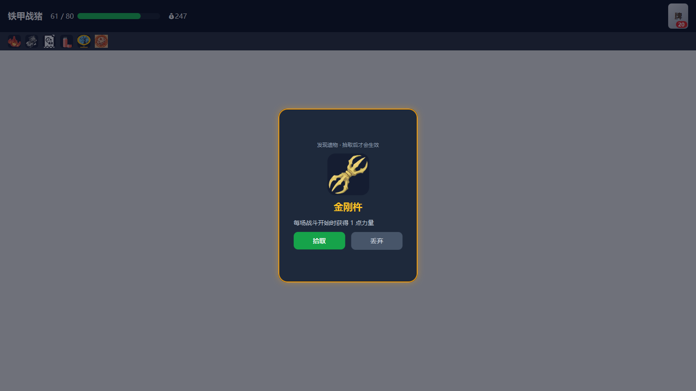<br><b>遗物获取</b> · 拾取或丢弃，拾取后才生效</td>
</tr>
<tr>
<td width="50%">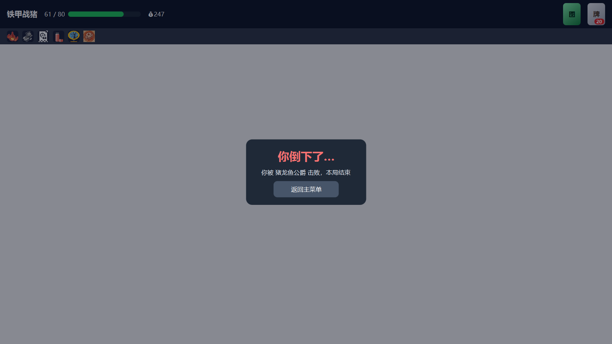<br><b>死亡结算</b> · 显示被谁击败，可返回主菜单</td>
<td width="50%"></td>
</tr>
</table>

---

## 玩法

一局游戏的流程：**选人 → 起点房间拿遗物 → 沿 17 层地图向上推进 → 击败 BOSS**。

地图每层随机生成 3~5 个房间，类型包括怪物、精英、事件、商店、篝火、宝箱；相邻层之间有 1~2 条连线，玩家在岔路口自行规划路线。走到的房间决定遇到什么，房间里的选择决定构筑往哪个方向走。

- **战斗**：回合制。每回合 3 点能量，用能量打出手牌（攻击 / 技能 / 能力三类），结束回合后敌人行动。格挡、力量、易伤、虚弱、消耗等状态与《杀戮尖塔》一致。
- **构筑**：35 张卡牌，战斗胜利三选一、商店购买、事件获取；篝火和事件可以强化或移除卡牌。
- **遗物**：34 件遗物，被动效果，来源包括起点赠予、精英掉落、事件、商店、BOSS 奖励。
- **随机事件**：7 个事件，每个 3 个选项，代价与收益都写在面板上。
- **死亡即结束**：单局单命，死亡后回到主菜单重新开始。

### 种子化与存档

整局游戏的随机性都从「地图种子」这一个 `long` 派生：地图布局、战斗洗牌、敌人行为、奖励内容，全部走各自独立、但由同一颗种子派生的随机流。

这意味着**同一个存档读进去，看到的局面一模一样** —— 玩家无法靠"退出重进"刷起手牌或刷遗物。存档为单槽，写在 `~/.slay-the-spire-save.properties`。

---

## 快速开始

### 环境要求

| 项目 | 版本 |
| --- | --- |
| JDK | 17 或更高 |
| Maven | 3.8+ |
| JavaFX | 21.0.6（由 Maven 自动拉取，无需手动装 SDK） |

### 运行

```bash
mvn clean javafx:run
```

主类是 `com.example.demo.HelloApplication`，已在 `pom.xml` 的 `javafx-maven-plugin` 里配置好。

> 项目同时提供了 `Launcher`，它不继承 `Application`，用于把程序打成可执行 jar 后直接 `java -jar` 启动（此时 JavaFX 由 fat jar 内置）。

### 用 IDEA 运行

直接用 IDEA 打开本目录（识别为 Maven 工程），运行 `HelloApplication` 即可。

---

## 项目结构

```
.
├── pom.xml                              Maven 配置（JavaFX 21.0.6 / JDK 17）
├── mvnw / mvnw.cmd                      Maven Wrapper
├── docs/shots/                          README 用的实机截图（13 张，1600×900）
└── src/main/
    ├── java/com/example/demo/
    │   ├── HelloApplication.java        入口 + 唯一场景调度中心 + 节点分派
    │   ├── Launcher.java                非 JavaFX 启动器（打 jar 用）
    │   ├── battle/   BattleView         战斗流程与回合推进
    │   ├── card/     Card / CardPlay / CardFaceView / BattleState /
    │   │             CardRewardPool / ArtCalibrator
    │   ├── character/ Player / Relic / RelicFun / CharacterSelect
    │   ├── enemy/    Enemy + EnemyFactory + 10 种敌人
    │   ├── event/    EventDef / EventView
    │   ├── operator/ DevEntry / DevModeSwitch / DevPanel   开发者模式
    │   ├── save/     SaveData            单槽存档读写
    │   ├── settings/ GameSettings        音量 / 全屏等设置
    │   ├── sound/    Music / MusicFx / SoundFx
    │   └── view/     17 个界面类：MainMenu、MapView、GameMap、RunHud、
    │                 ShopView、RestView、RoomView、DeathOverlay、
    │                 SpriteAnimator、CardFlyFx、PileOverlay …
    └── resources/com/example/demo/
        ├── art/          36 张卡面插画
        ├── relic/        34 张遗物图标
        ├── portrait/     14 张敌人立绘
        ├── icons/        29 张界面图标
        ├── sound/        14 个音频（背景音乐与音效）
        ├── encounter/     1 张遭遇图
        └── *.png         场景背景与事件插图
```

---

## 系统一览

### 战斗模块

- `BattleView` 是战斗的唯一执行者，同时实现 `BattleState` 接口供卡牌回调。
- 出牌只有一个入口 `CardPlay.play(Card)`，结算顺序固定：扣能量 → 特殊前置（断魂斩消耗非攻击牌、放血自伤）→ 消耗一次性攻击加成 → 按 hits 结算伤害 → 获得格挡 → 卡牌效果 switch → 抽牌 → 触发 `onCardPlayed` → 刷新界面。
- **两条独立随机流**：`shuffleRnd` 负责洗牌与弃牌堆回洗，`miscRnd` 负责其它随机（如"坚毅"随机消耗手牌）。拆开是为了防止玩家反复打出某张牌来操纵牌序。
- 敌人效果统一落在 `performEnemyAction()`；立绘动画由自写的 `SpriteAnimator` 帧循环驱动（放弃 `Timeline`，避免多个动画争抢同一个节点的 transform）。
- 抽牌/弃牌/消耗的"飞行"演出是纯视觉层：数据即时结算，另挂一张只读的 ghost 卡面飞过去，飞完摘掉。

### 地图模块

- `GameMap` 负责生成，`MapView` 负责绘制，两者严格分离。
- 生成三步：① 每层摆 3~5 个节点并定类型 → ② 相邻层连边 → ③ 定本局 BOSS 种类。
- **连边保证零交叉**：下层第 `i` 个节点连到上层第 `round(i × (m−1) / (n−1))` 个。这个映射单调不减，两端顺序永不颠倒，所以线段不可能交叉。
- **画面上的"不呆板"交给表现层**：`MapView` 用固定种子给每列加 ±100px 水平抖动，只改显示坐标、不动拓扑。
- 节点类型判定中所有随机数都**无条件消耗**（先取随机数、再判禁用），以保证同一颗种子的地图可复现。

### UI 资源

- 卡面由 `CardFaceView` 分 6 层绘制：插画 → 类型底板 → 稀有度缎带 → 卡名 → 描述 → 能力标记。
- 所有界面共用一个顶部 `RunHud`（血量、金币、遗物条、牌组入口），覆盖层挂在最外层 `StackPane` 上。
- 全项目只有一次 `setScene`，之后切换界面一律用 `Scene.setRoot(root)`，避免窗口尺寸跳动。

---

## 数据一览

| 项目 | 数量 |
| --- | --- |
| Java 源文件 | 52 |
| 卡牌（`Card.Kind`） | 35 |
| 遗物 | 34 |
| 敌人 | 10 种（含 2 个 BOSS） |
| 随机事件 | 7 个 |
| 事件效果类型（`EventDef.Action`） | 14 |
| 地图层数 | 17（起点 1 层 + 中间 14 层 + 篝火 + BOSS） |
| 图片资源 | 128（卡面 36 / 遗物 34 / 立绘 14 / 图标 29 / 场景 15） |
| 音频资源 | 14 |

---

## 已知问题

- 事件页左下角仍显示「事件背景占位图」提示（`event_bg.png` 尚未提供）。
- 商店页顶部同时显示 HUD 金币与「当前金币」，信息重复。
- 部分源码注释停留在旧版本，与实现不一致（例如每层房间数注释写 4~5、实际 3~5）。读代码时以代码为准。
- 项目没有自动化测试，随机性相关的约束（如"随机数消耗次数与判定结果解耦"）目前只靠注释与探针脚本保证。

---

课程作业，仅供学习交流。美术与音频素材部分来自网络，版权归原作者所有。
